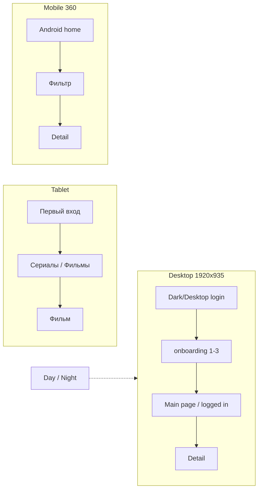
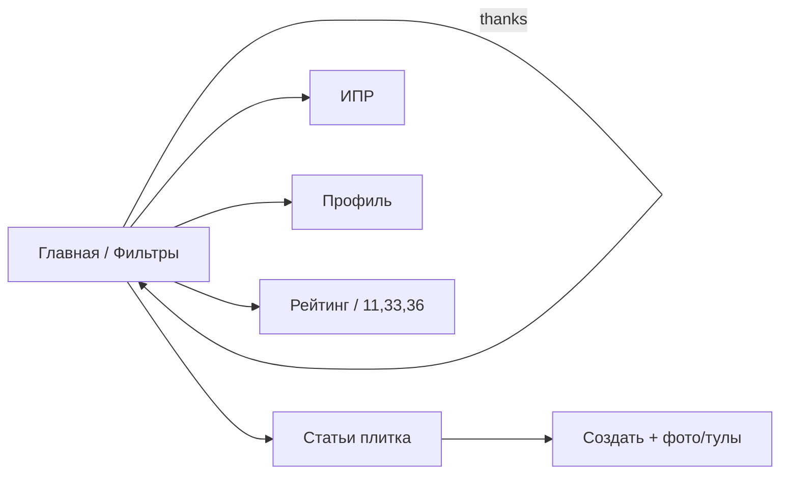
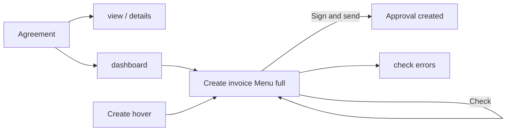

# Анализ SVG-макетов (styles) — паттерны и user flow

Источник: `images-originals/{coin,tvip,docsbird} styles/`  
Артборды Figma экспортированы в SVG; desktop Coin/TVIP часто **1920×963** или **1920×935**.

---

## 1. Общие паттерны состояний компонентов

| Паттерн | Coin | TVIP | DocsBird |
|--------|------|------|----------|
| **Primary CTA** | Pill `rx=18`, fill `#3273E1`, h≈36px | Pill `rx=25`, fill `#F4511E`, h≈50px | Green header `#30735D`, CTA в toolbar |
| **Secondary / ghost** | Outline / серый текст `#909090` | Ghost на тёмном фоне, border `#A1A1A1` | `mock-btn-secondary`, серые границы |
| **Nav active** | Подчёркивание 2px `#3273E1` под табом | Sidebar item + accent orange | Sidebar `is-active`, зелёный фон |
| **Nav default** | `#212121` / `#909090` | `#888888` labels | `#475569` / muted green-gray |
| **Input default** | Белый фон, border `#BCBCBC` | Белая карточка login, stroke `#A1A1A1` | `mock-field`, border `#d1e0d6` |
| **Input focus** | (в макете — синяя обводка) | — | Accent ring green |
| **Chip / filter active** | Blue fill soft `#EAF1FC` | Orange soft + border accent | Filter tab active |
| **Chip default** | Gray border | Transparent on dark | Inactive tab |
| **Card** | White surface, shadow light | Poster 2:3, gradient placeholders | Agreement card + status badge |
| **Status badge** | — | — | Active / Draft / Expiring (цвет) |
| **Error** | — | — | Agreement check errors, red hints |
| **Loading** | — | — | Spinner на Check |
| **Success** | Coin rain 🪙 | — | Approval created / sent screen |
| **Dropdown open** | Compose tools | — | Create menu, Sign and send split |
| **Empty** | Invitation bulk empty | — | Bulk empty state |

Правило для интерактива: каждое нажатие переключает **один** из слоёв `default → active → (disabled|success)` без «мёртвых» зон.

---

## 2. Design tokens (из SVG)

### Coin
| Token | Значение |
|-------|----------|
| Primary | `#3273E1` |
| Text | `#212121` |
| Muted | `#909090`, `#BCBCBC` |
| Surface | `#FFFFFF` |
| Surface soft | `#EAF1FC`, `#E8F2FF` |
| Gold (thanks) | `#F1B31C` |
| Sidebar width | ~310px → **16.1%** от 1920 |
| Viewport | 1920×963 (лента), до 2029 scroll |

### TVIP
| Token | Значение |
|-------|----------|
| Accent | `#F4511E` |
| Text primary | `#333333` |
| Text muted | `#888888`, `#7A7A7A` |
| Night bg | `#060818` / deep `#201544` |
| Login card | 500×541, `rx=3`, white + shadow |
| Login card position | ~(37%, 21%) от 1920×935 |
| Desktop frame | **1920×935** |
| Tablet portrait | 640×1024, 1024×1122 |
| Mobile | 360×926…1360 |
| Lang toggle | RU/EN segment top-right |

### DocsBird
| Token | Значение |
|-------|----------|
| Header | `#30735D` (h≈72px) |
| Accent | `#3C9074` |
| Text | `#161417` |
| Muted | `#858586`, `#A9ABAC` |
| Page bg | `#F8F6F4` |
| Warning | `#D1830D` |
| Viewport | ~1371×826 (agreements) |

---

## 3. User flows (по именам файлов)

### TVIP

### Coin

### DocsBird

---

## 4. Реализация в коде

| Кейс | HTML | CSS | Фикс. пропорции stage |
|------|------|-----|------------------------|
| TVIP | `tvip-screens.html` | `case-mocks.css` `--tvip-*` | Desktop **1920/935**, tablet 640/1024, mobile 360/926 |
| Coin | `coin-social.html` | `coin-mock__*`, `ai-cases.css` theme coin | **1920/963** |
| DocsBird | `docsbird-flow.html` | `docsbird-flow__*`, `docsbird-form__*` | **1371/826** |

Гибрид: структура и UI — HTML; полноэкранные иллюстрации (небо login) при необходимости — WebP из `scripts/optimize-case-mocks.mjs`.
