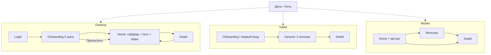
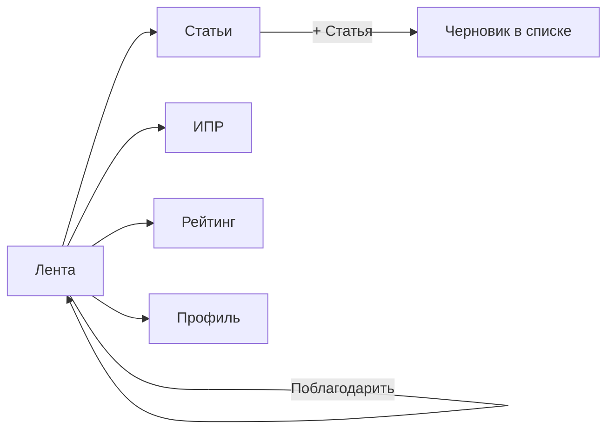
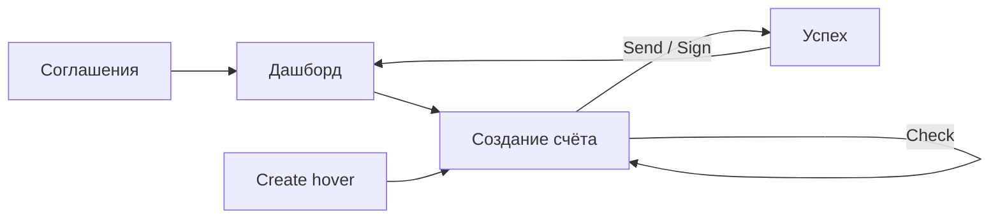

# Интерактивные моки кейсов — UX-спецификация

Дата: 2026-05-23  
Версия: 2.0 (HTML-first)

## 1. Юзер-тестирование (текущая версия на проде)

Метод: сценарное прохождение как рекрутер/заказчик, без подсказок. Сайт: GitHub Pages, ru-локаль.

### TVIP

| # | Задача | Результат | Severity |
|---|--------|-----------|----------|
| T1 | Найти, что можно нажать на макете | Видна только «Войти»; остальное — картинка | Critical |
| T2 | Перейти на главную после входа | Работает, но без ощущения «приложения» | Major |
| T3 | Tablet — отдельный продукт | WebP desktop в рамке планшета | Critical |
| T4 | День на mobile | Тема не меняет мобильный экран визуально | Major |
| T5 | Скролл рядов постеров | Неочевиден (нет настоящего скролла) | Major |
| T6 | Дубли JPG «День/Ночь» ниже мока | Путаница: зачем два способа смотреть тему | Minor |

### Coin

| # | Задача | Результат | Severity |
|---|--------|-----------|----------|
| C1 | Понять, что лента живая | После возврата HTML — ок | — |
| C2 | Фильтр «С фото» | Работает | — |
| C3 | Монеты благодарности | Работает | — |
| C4 | Соответствие тексту «как в Figma» | Визуал упрощён, но приемлемо для демо | Minor |

### DocsBird

| # | Задача | Результат | Severity |
|---|--------|-----------|----------|
| D1 | Пройти соглашение → счёт | Табы помогают; форма живая | — |
| D2 | Меню Create при наведении | Работает | — |
| D3 | AI / Check / Send | Работает в блоке «Счёт» | — |
| D4 | Связь с макетами Figma | Слабая в списке соглашений | Minor |

**Вывод:** WebP + невидимые hotspots не подходят для портфолио UX. Нужна **вёрстка компонентов** + тема через CSS-токены.

---

## 2. User flow

### 2.1 TVIP

### 2.2 Coin

### 2.3 DocsBird

---

## 3. Требования к реализации

### Общие (все кейсы)

- R0. Интерактивные элементы — **настоящие** `button`, `input`, `nav`, `a`, не прозрачные зоны на картинке.
- R0b. **Без Tailwind в HTML моков** — только продуктовые классы (`tvip-*`, `coin-mock__*`, `docsbird-flow__*`) и CSS-переменные темы в `css/case-mocks.css` / `css/ai-cases.css`. Tailwind на странице кейса — только для оболочки портфолио.
- R1. Состояния: `hover`, `active`, `focus-visible`, `disabled` где уместно.
- R2. Скролл: `overflow: auto`, кастомный scrollbar; **скрывать полосу**, если контент влезает (`ResizeObserver`).
- R3. Сброс демо (↻) возвращает начальный экран и состояние форм.
- R4. Доступность: `aria-label`, видимый фокус, логичный порядок табуляции внутри мока.
- R5. Производительность: без SVG >5 MB в рантайме; постеры — CSS-градиенты или лёгкий WebP фон hero при необходимости.

### TVIP

- T-R1. **Desktop:** login (облака только ночь) → onboarding → home → detail.
- T-R2. **Tablet:** onboarding → catalog grid → detail (отдельная вёрстка, не масштаб desktop).
- T-R3. **Mobile:** home → filter → detail; нижняя навигация с активным табом.
- T-R4. **День/ночь** меняют CSS-переменные на **всех** устройствах, включая mobile.
- T-R5. Сайдбар desktop: переключение active у пунктов (визуально).
- T-R6. Горизонтальные ряды: нативный горизонтальный скролл с snap.
- T-R7. Переключатель устройства сохраняет тему; смена устройства — стартовый экран флоу.

### Coin

- C-R1. Панели: feed, articles, growth, rating, profile — переключение без перезагрузки.
- C-R2. Фильтры ленты, лайк, монеты, compose/publish — как в текущем `coin-social.html`.
- C-R3. Визуальные токены из `ai-cases.css` theme coin.

### DocsBird

- D-R1. Экраны: agreements → dashboard → create → sent.
- D-R2. Flyout-меню Create по hover/focus.
- D-R3. Форма счёта: поля, AI, check, split Send, preview обновляется.
- D-R4. Табы сверху дублируют навигацию для ясности.

---

## 4. Архитектура (v2)

| Кейс | Подход |
|------|--------|
| TVIP | `components/case-mocks/tvip-screens.html` + `tvip-case-mock.js` |
| Coin | `components/case-mocks/coin-social.html` + `case-mocks.js` |
| DocsBird | `components/case-mocks/docsbird-flow.html` + `docsbird-case-mock.js` + `ai-cases-demos.js` |

WebP-оверлеи (`case-mock-svg.js`, `tvip-mock-overlays.js`) — **не используются** в кейсах (остаются только для скрипта `optimize:case-mocks` при экспорте референсов).

---

## 5. Критерии приёмки

- [ ] Все пункты R0–R5 выполнены на трёх кейсах.
- [ ] TVIP: прохождение T-R1…T-R7 без подсказок за &lt; 2 мин.
- [ ] Mobile TVIP в **дневной** теме визуально светлый (фон, текст, chrome).
- [ ] Нет статичных JPG день/ночь под моком TVIP.
- [ ] Lighthouse: блок мока не тянет &gt; 500 KB на первую отрисовку (без учёта cache).
